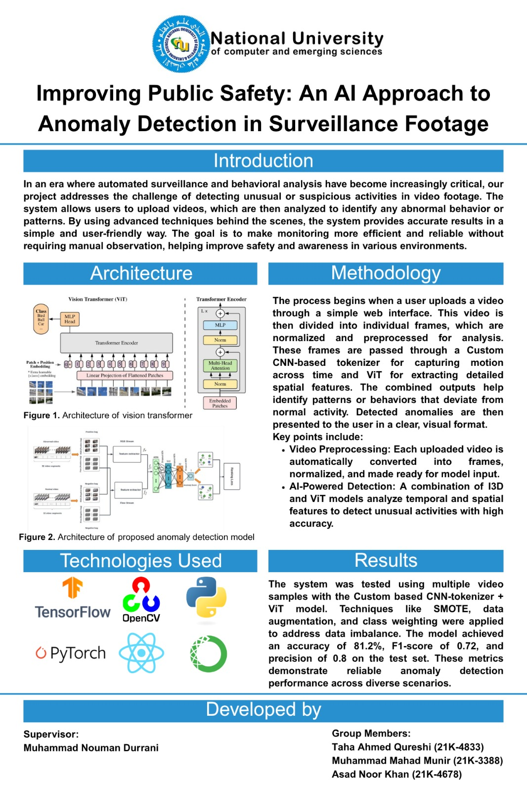

# Guardian Vision: Transformer-Based Anomaly Detection in Surveillance Footage

## Overview

**Guardian Vision** is a research-driven computer vision system for **real-time anomaly detection** in live surveillance video streams. Built using a hybrid deep learning approach, the system fuses **Inflated 3D ConvNets (I3D)** with **Vision Transformers (ViT)** to identify abnormal human behavior across various public safety scenarios.

The app allows users to input the **IP address of a CCTV camera**, enabling **live monitoring** and instant anomaly flagging without manual video review.

---

## 🔍 Motivation

Manual video surveillance is resource-intensive, inconsistent, and prone to human error. Guardian Vision was developed to:
- Automate the detection of dangerous or suspicious behavior
- Reduce reaction time in critical events
- Improve surveillance system intelligence using deep learning

---

## 🧠 Key Research Contributions

- **Hybrid Architecture**: Combines I3D (for spatio-temporal modeling) and ViT (for long-range contextual attention).
- **Two-Stream Design**: Uses RGB and optical flow streams to detect subtle human motion.
- **Data Imbalance Handling**: Utilizes SMOTE, data augmentation, and weighted loss to deal with rare anomaly classes.
- **Live Surveillance**: Accepts a CCTV IP input to monitor and analyze live footage on-the-fly.
- **Weakly Supervised Learning**: Employs a top-k segment selection strategy to focus learning on the most informative video segments.

---

## 🧪 Model Flow (Summarized in Poster Below)

Instead of detailed architecture visuals, here’s a view of the entire system methodology and key concepts captured in the official project poster:

---

## 📊 Performance

Evaluated on the **UCF-Crime Dataset** containing 1,920 real-world surveillance videos.  

| Metric     | Score     |
|------------|-----------|
| Accuracy   | 81.2%     |
| Precision  | 0.80      |
| F1-Score   | 0.72      |
| Dataset    | 13 anomaly classes (e.g., robbery, arson, assault) |

---

## 🖥️ System Interface

- Built using **React** for both web and mobile.
- Users enter an **IP address of a live CCTV camera** to start real-time surveillance.
- Detected anomalies are shown instantly as labeled alerts (e.g., "Robbery Detected").

---

## 📂 Dataset: UCF-Crime

The system is trained and evaluated on the **UCF-Crime dataset**, containing:

- 1920 long untrimmed videos (960 normal, 960 abnormal)
- 13 real-world anomaly types:
  Abuse, Arrest, Arson, Assault, Burglary, Explosion, Fighting, Road Accidents, Robbery, Shooting, Shoplifting, Stealing, Vandalism

---

## 📌 Conclusion

Guardian Vision demonstrates how **Transformer-based models** can be practically deployed for **live, real-time anomaly detection**. This system contributes to AI-powered public safety infrastructure by providing an **intelligent**, **scalable**, and **automated** surveillance solution.

---

## 👨‍💻 Team
- **Muhammad Mahad Munir** – 21K-3388
- **Taha Ahmed** – 21K-4833    
- **Asad Noor Khan** – 21K-4678  
- **Supervisor**: Muhammad Nouman Durrani  
- **Institute**: FAST NUCES, Karachi Campus  
- **Year**: 2025

---

